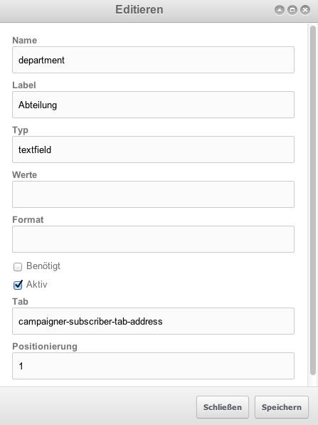

# Campaigner

## [Newsletter](id:newsletter)
*Newsletter die in dafür vorgesehenen MODx-Containern erstellt werden, werden automatisch in die Newsletter-Komponente übernommen. Zudem werden bereits versendete Auto-Newsletter Instanzen hier abgelegt um ein Archiv zur Verfügung stellen zu können*
### Handhabung
* Erstellen der Ressource als normale Ressource
	* Einstellen der geplanten Versandzeit durch das Veröffentlichungsdatum
	* Anhängen von Attachments
* Automatische Übernahme in die Komponente
* Definieren der Gruppe(n) an welche der Newsletter versendet werden soll
* Voransicht anzeigen lassen
* Versand an Test-Abonnenten zur Kontrolle

### Funtionen
* Vorschau
	* Voransicht des Newsletters ohne prozessierte Tags (z.B.: [[+campaigner.firstname]])
	* Voransicht des Newsletters für einen Abonnenten. Dadurch werden oben genannte Tags prozessiert (z.B.: aus [[+campaigner.firstname]] wird 'Andreas')
	* Text-Mail anzeigen
* Test-Versand
	* Versand an einen einzelnen Abonnenten oder externe E-Mail Adresse
		* Optionale Personalisierung
	* Versand an eine Gruppe von Abonnenten
		* Optionale Personalisierung
	* Hinzufügen einer Nachricht (z.B.: 'Mit der Bitte um Kontrolldurchsicht')
* Auslösung
	* Ein geplanter Newsletter kann auf Wunsch sofort ausgelöst werden

###Verfügbare Tags
*Es stehen sogenannte Tags zur Verfügung die es ermöglichen Informationen über den Newsletter (z.B. Gesamtanzahl) im Newsletter zu hinterlegen*

**Derzeit verfügbare Tags**

* Total [campaigner.total]
* Sender [campaigner.sender]
* Sender Email [campaigner.sender_email]
* Date [campaigner.date]
* Send date [campaigner.send_date]

---

## [Auto-Newsletter](id:auto-newsletter)
### Handhabung
### Funtionen

---

## Abonnenten
*Abonnenten sind die Empfänger von Newslettern. Diese werden entweder durch die eigene Anmeldung an den Newsletter erstellt oder können durch Import in das System eingepflegt werden. Je mehr Informationen über einen Abonnenten vorhanden sind, umso spezifischer können Newsletter gestaltet werden*

### Handhabung
* Selbstanmeldung
	* Der User meldet sich über ein auf der Website positioniertes Formular für den Newsletter an
	* Durch das "Opt-In" System wird ihm zunächst ein Mail mit Aktivierungslink zugesendet, welcher geklickt werden muss um den Abonnenten zu aktivieren. (dies kann von Benutzern mit ausreichenden Rechten auch händisch durchgeführt werden)
* Selbstabmeldung
	* Laut Gesetz muss in jedem versendeten Newsletter ein Link zur Abmeldung zur Verfügung stehen. Durch Klick auf diesen Link wird der Abonnent auf eine Seite geleitet die ihm dies ermöglicht und auch ein Grund zur Abmeldung kann angegeben werden.
	* Benutzer mit ausreichenden Berechtigungen können Abonnenten auch händisch aus dem System entfernen oder deaktivieren.

### Funtionen
* Erstellen/Bearbeiten
	* Bei der Erstellung/Bearbeitung eines Abonnenten gibt es benötigte Felder und optionale Felder
	* Das einzig **benötigte** Feld ist die **E-Mail Adresse**
	* Das Erstellungs-/Bearbeitungsfenster eines Abonnenten teilt sich in 4 Tabs auf:
		* Generell - Grundlegende beschreibende Daten
		* Adresse - Adressdaten wie Strasse, PLZ, Ort, Land
		* Gruppen - angehörige Gruppen
		* Felder - benutzerdefinierte Felder (systemabhängig, siehe [Felder](#fields))
* Statistiken
	* Abonnenten-Statistiken zum Öffnungs-, Klickverhalten. Gesamthaft und pro Newsletter angewendet
* Deaktivieren - Abonnenten deaktivieren (erhält keine Newsletter mehr, bleibt aber im System erhalten)
* Entfernen - Abonnenten unwiderrruflich aus dem System entfernen

###Verfügbare Tags
*Es stehen sogenannte Tags zur Verfügung die es ermöglichen Informationen über den Abonnenten (z.B. Name, Adresse) im Newsletter zu hinterlegen und dadurch den Newsletter zu personalisieren*

**Derzeit verfügbare Tags**

* Email [campaigner.email]
* Firstname [campaigner.firstname]
* Lastname [campaigner.lastname]
* Address [campaigner.address]
* Salutation [campaigner.salutation]
* Unsubscribe [campaigner.unsubscribe]
* Is Text [campaigner.istext]
* Key [campaigner.key]
* Tracking image [campaigner.tracking_image]
* **zusätzlich können Abonnenten mit benutzerdefinierten Feldern versehen werden (siehe [Felder](#fields))**

---

## [Bouncing](id:bounces)
*Bounces sind vom Empfänger oder Empfänger-Server abgelehnte Mails. Hier können diese aufgelistet und nötfalls manuell bearbeitet werden.*
### Handhabung
### Funtionen

---

## [Warteschlange](id:queue)
*In der Warteschlange werden alle bereits versendeten als auch zum Versand vorgemerkten Mails aufgelistet.*
### Handhabung
### Funtionen

---

## [Statistiken](id:statistics)
*Statistken bieten eine Darstellung von gesammelten Daten zum Userverhalten.*

** Gesammelt werden **

* Newsletter-Öffnungen (abhängig davon ob der verwendete Client Bilder anzeigt)
* Klicks
	* normaler Link,
	* Facebook, Twitter oder andere soziale Netzwerke, die im [Social Sharing](#social-sharing) hinterlegt sind,
* Bounces
* Abmeldungen (abhängig davon ob der verwendete Client Bilder anzeigt)
### Handhabung
### Funtionen

---

## [Social-Sharing](id:social-sharing)
*Social-Sharing bietet die Möglichkeit einerseits Share-Links für einzelne Artikel zu implementieren, andererseits z.B. auf die eigene Seite in einem Social-Network hinzuweisen. In der Dokumentation findet sich ein Beispiel beider Implementationen.*

### Handhabung & Implementierung
Es steht das Snippet *CampaignerSharing* zur Verfügung welches es ermöglicht alle aktiven Social-Sharing-Elemente einfach einzubinden.

**Einbindung des Snippets:**

	[[!CampaignerSharing? &url=`[[~[[+id]]? scheme=`full`]]`]]

### Funtionen
* Erstellen/Bearbeiten - siehe [Screen](#screen_socialsharing)
	* Name - Beschreibender Name des Elements
	* URL - Der URI wobei mit dem Platzhalter [[+url]], der übergebene Link mitgegeben wird (z.B.: http://www.facebook.com/share.php?u=[[+url]])
	* Icon - Das Icon des Dienstes
	* Linktext - Der anzuzeigende Linktext
	* Suchmuster - Dient zur Erfassung in den [Statistiken](#statistics) um Links auf soziale Netzwerke identifizieren zu können
	* Aktiv - Status des Elements (inaktive werden nicht implementiert bzw stehen nicht zur Verfügung)
* Entfernen - Löschen des Elements
* Aktivieren/Deaktivieren (nicht implementiert)

---

## [Felder](id:fields)
### Handhabung
### Funtionen

---

## [Rechte-Management](id:permissions)
### Handhabung
### Funtionen
### Informationen
#### Newsletter

| Schlüssel | Bereich | Bezeichnung | Beschreibung |
|-----------|-------------|--------------|
| campaigner.newsletter_approve | Newsletter |  |  |
| campaigner.newsletter_remove | Newsletter |  |  |
| campaigner.newsletter_remove_batch | Newsletter |  |  |
| campaigner.newsletter_clearing | Newsletter |  |  |
| campaigner.newsletter_kick | Newsletter |  |  |
| campaigner.newsletter_edit | Newsletter |  |  |
| campaigner.newsletter_editprops | Newsletter |  |  |
| campaigner.newsletter_editgroups | Newsletter |  |  |
| campaigner.newsletter_clean | Newsletter |  |  |
| campaigner.newsletter_clean_dehtml | Newsletter |  |  |
| campaigner.newsletter_clean_archive | Newsletter |  |  |
| campaigner.newsletter_clean_trash | Newsletter |  |  |
| campaigner.newsletter_preview | Newsletter |  |  |
| campaigner.newsletter_sendtest | Newsletter |  |  |
| &nbsp;
| campaigner.autonewsletter_approve | Auto-Newsletter |  |  |
| campaigner.autonewsletter_kick | Auto-Newsletter |  |  |
| campaigner.autonewsletter_editgroups | Auto-Newsletter |  |  |
| campaigner.autonewsletter_editprops | Auto-Newsletter |  |  |
| campaigner.autonewsletter_edit | Auto-Newsletter |  |  |
| &nbsp;
| campaigner.groups_create | Gruppe |  |  |
| campaigner.groups_edit | Gruppe |  |  |
| campaigner.groups_remove | Gruppe |  |  |
| &nbsp;
| campaigner.subscriber_create | Abonnent |  |  |
| campaigner.subscriber_edit | Abonnent |  |  |
| campaigner.subscriber_remove | Abonnent |  |  |
| campaigner.subscriber_togglestatus | Abonnent |  |  |
| campaigner.subscriber_import | Abonnent |  |  |
| campaigner.subscriber_export | Abonnent |  |  |
| campaigner.subscriber_showstats | Abonnent |  |  |
| &nbsp;
| campaigner.bounce_fetch | Bounces |  |  |
| campaigner.bounce_hard_remove | Bounces |  |  |
| campaigner.bounce_hard_togglestatus | Bounces |  |  |
| campaigner.bounce_soft_remove | Bounces |  |  |
| campaigner.bounce_soft_togglestatus | Bounces |  |  |
| campaigner.bounce_resend_remove | Bounces |  |  |
| &nbsp;
| campaigner.queue_process | Warteschlange |  |  |
| campaigner.queue_cleartests | Warteschlange |  |  |
| campaigner.queue_remove | Warteschlange |  |  |
| campaigner.queue_send | Warteschlange |  |  |
| &nbsp;
| campaigner.statistics_showdetails | Statistiken |  |  |
| campaigner.statistics_export | Statistiken |  |  |
| campaigner.statistics_opens_export | Statistiken |  |  |
| campaigner.statistics_clicks_export | Statistiken |  |  |
| campaigner.statistics_unsubscriptions_export | Statistiken |  |  |
| &nbsp;
| campaigner.sharing_create | Sharing |  |  |
| campaigner.sharing_edit | Sharing |  |  |
| campaigner.sharing_remove | Sharing |  |  |
| campaigner.sharing_togglestatus | Sharing |  |  |
| campaigner.sharing_dragsort | Sharing |  |  |
| &nbsp;
| campaigner.field_create | Feld |  |  |
| campaigner.field_edit | Feld |  |  |
| campaigner.field_remove | Feld |  |  |

---

## [Screenshots](id:screens)
### [Social-Sharing](id:screen_socialsharing)

### [Abonnenten bearbeiten](id:screen_subscriber_edit)

### [Gruppe bearbeiten](id:screen_group_edit)

### [Felder bearbeiten](id:screen_fields_edit)

### [Test-Versand](id:screen_sendtest)

First Header | Second Header | Third Header
:----------- | :-----------: | -----------:
Left         | Center        | Right
Left         | Center        | Right